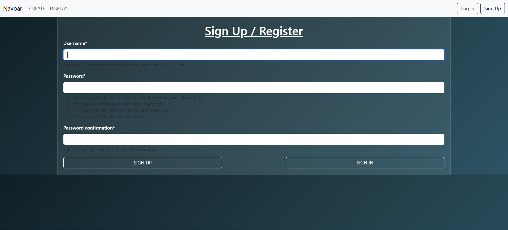
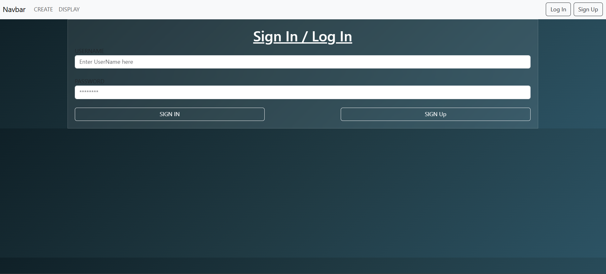
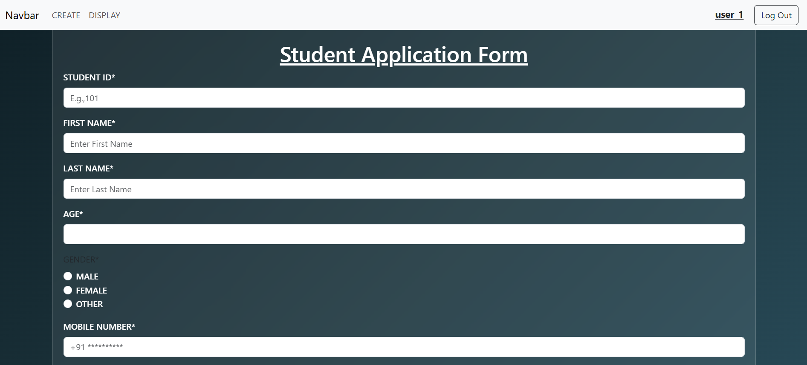
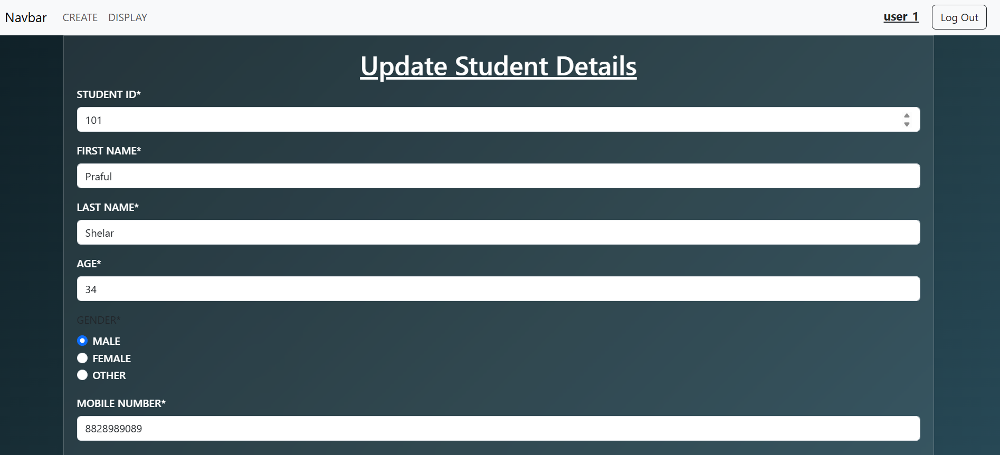
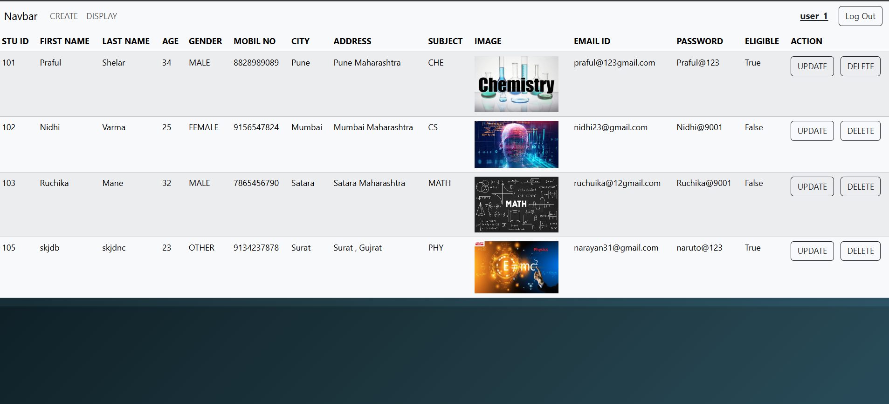
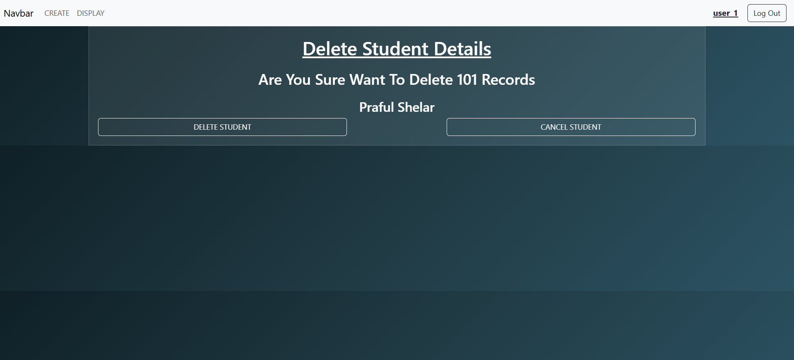

# 🎓 Student Management System (CRUD) - Django

A simple **Student Management System** built using **Django**.  
This project allows you to **Add, Display, Update, and Delete** student details easily.  
It also supports **image upload for student profile photos**.

---

## 🚀 Features

- Add new students with details & photo
- Display student list
- Update student information
- Delete students
- Django Class Based Views (GET & POST)
- Bootstrap UI

---

## 🛠️ Tech Stack

| Technology | Purpose |
|------------|----------|
| Python | Programming Language |
| Django | Backend Framework |
| MySQL | Database |
| HTML, CSS, Bootstrap | Frontend UI |

---

---

## 📸 Screenshots

---

### 🔐 Authentication
- **Sign Up Page**
  
- **Sign In Page**
  

---

### ➕ Add Student (Form)
- **Page 1**
  
- **Page 2**
  

---

### ✏️ Update Student
- **Page 1**
  
- **Page 2**
  

---

### 📋 Display Student


---

### 🗑️ Delete Student



---

## ▶️ Setup Instructions (Run Locally)

```bash
# Clone the repository
git clone https://github.com/omkarpawar2002/student-management-system-practice-project.git

# Move into project
cd student-management-system-practice-project

# Create virtual environment
python -m venv venv
venv\Scripts\activate 

# Install dependencies
pip install -r requirements.txt

# Run the server
python manage.py runserver
